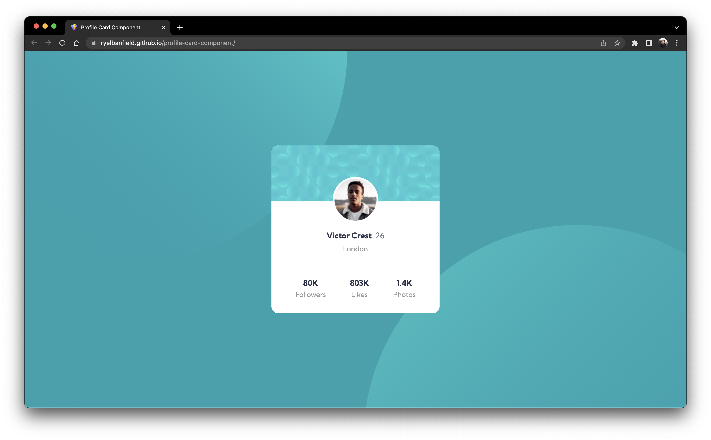

# Frontend Mentor - Profile card component solution

This is a solution to the [Profile card component challenge on Frontend Mentor](https://www.frontendmentor.io/challenges/profile-card-component-cfArpWshJ). Frontend Mentor challenges help you improve your coding skills by building realistic projects.

## Table of contents

- [Overview](#overview)
  - [The challenge](#the-challenge)
  - [Screenshot](#screenshot)
  - [Links](#links)
- [My process](#my-process)
  - [Built with](#built-with)
  - [What I learned](#what-i-learned)
  - [Continued development](#continued-development)
- [Author](#author)

**Note: Delete this note and update the table of contents based on what sections you keep.**

## Overview

### The challenge

- Build out the project to the designs provided

### Screenshot

### Links

- [Live Site URL](https://ryelbanfield.github.io/profile-card-component/)

## My process

### Built with

- [Create R1 App](https://www.npmjs.com/package/create-r1-app) - A tool I created to speed up project setup
- [Vite](https://vitejs.dev/) - Development tool
- [React](https://reactjs.org/) - JS library
- [TailwindCSS](https://tailwindcss.com/) - For styling

### What I learned

By building this component, I gained a better understanding of positioning and arbitrary values in TailwindCSS.

### Continued development

In the future I will continue to build out more complex UIs to make styling and layout building almost second nature.

## Author

- Website - [Ryel Banfield's Website & Blog](https://ryelbanfield.vercel.app/)
- Contra - [Reach out for freelance work](https://contra.com/ryelbanfield)
- Frontend Mentor - [@RyelBanfield](https://www.frontendmentor.io/profile/RyelBanfield)
